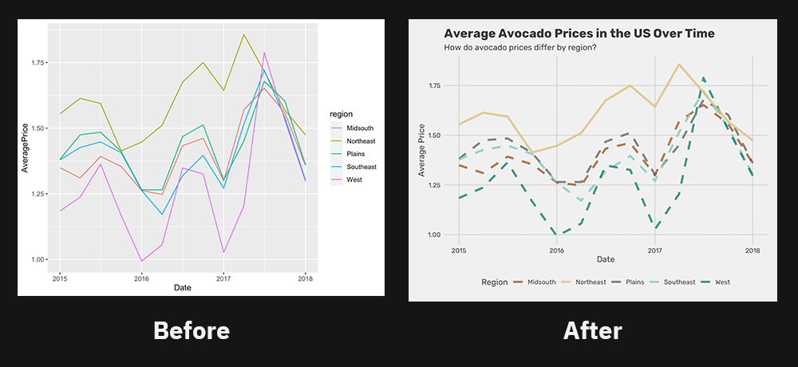

Ggplot is one of the main things I hear people praise when it comes to using R instead of other programming languages such as Python. I have heard arguments as the plots from ggplot looking good and how easy and flexible they are. However, I don't feel like I have been able to fully take advantage of these features of ggplot. The standard graphs they create look really basic, such as this:
<br>
<br>

<br>
[Source](https://www.sthda.com/english/wiki/ggplot2-scatter-plots-quick-start-guide-r-software-and-data-visualization)
<br>
<br>
which doesn't look that good, although it might be quick. So I have used ggplot to make graphs quickly, but they haven't been to the point where I would consider publishing them. At the same time, I also see people making graphs like these:


<br>
[Source](https://metricsf20.classes.ryansafner.com/slides/1.3-slides#67)





[Source](https://imgur.com/1TDrLKJ)
<br>
<br>
and there is clearly a lot to learn about customizing ggplots. I have tried a few times myself and I constantly learn new things. However, I find that the mechanisms behind the plots are sometimes unclear, as the plots do not always behave the way I expect them to. Therefore, this project has two main goals. One is to learn about all the cool and useful features in ggplot to make good-looking and efficient plots. The other is to try to understand more of the mechanisms behind it so that I can edit the plots more successfully and not get stuck with unexpected changes.

<br>

# Grammar of Graphics

To start to understand the mechanics behind ggplot, I have to learn more about grammar of graphics, which is what ggplot is built on. I therefore read the following article by Hadley Wickham about [A Layered Grammar of Graphics](https://vita.had.co.nz/papers/layered-grammar.html).

The grammar of graphics works so that a plot is a result of several layers placed on top of each other.

The most basic level is the data. You have to map out the variables you use in aes() which creates a separate data set with the relevant columns, named after the variables you map them to (e.g. x, y, and shape). Second step is to change the values to fit what you are trying to map, this happens automatically with default options. For example, the numbers will be scaled to fit your coordinate plane (e.g. (2, 1, 4, 9) to (25, 0, 75, 200)) and the categories will get the name of the object displayed (e.g. (a, a, b, b) to (circle, circle, square, square)).

After the data transformations, you want to put together a basic plot. You need three main parts for this: the objects, the scale, and annotations. The data generates the objects, the scale and coordinate system (often by default options) generate the scales, and any text you might add, like a title, generate the annotations. There are a lot more steps to scaling the data, which are discussed more closely in the article.

Most of the components of ggplot are independent of each other, which allows you to easily add and remove components and make changes to one layer without affecting the other. This makes it easier to reuse data for plots. E.g. you can use the same code for the same plot, but different data, just by changing the main mappings in the first ggplot().

Each layer has four components: data and aes mappings, a statistical transformation, a geometric object (geom), and a position adjustment. Most of these will use default versions or responses from the main mappings by default.

There are several statistical transformations that can occur. There are often default options for each parameter. The most common ones are bin, boxplot, contour, density, identity, jitter, qq, quantile, smooth, summary, and unique. These options create new variables to our data set that are plots can be mapped to.

There are also a variety of geoms, ranging from 0 dimensions to 2 dimensions. 0 dimensions would be points or text, 1 dimension would be a path or line, while the 3 dimensions would be for shapes.

There is a default statistic for every geom and a default geom for every statistic. We therefore often just have to provide one of these and not both. For example, when you use a histogram geom, it is assuming that the stat will be bins and transforms the data to bins automatically. You could have created a historgram manually with a bar geom using the bin statistic (which is not the default option). However, there are plenty of these shortcuts with geoms. 

Scales control the mapping of data and there is a scale for each mapped aesthetic variable.

Coordinate systems are global, so they affect all variables and the geoms at once. The Cartesian coordinate system is used be default. However, you can change the plots by changing the coordinate system. For example a stacked bar geom in a Cartesian coordinate system looks like the usual bar graph we are used to. If you instead add a polar coordinate system, it will turn into a pie chart. There are plenty of variations like this from playing around with coordinate systems and other aesthetics. You usually don't need to know these combinations though, as there are often default geoms that adds the adjustments with defaults, such as histogram geoms. However, it helps understand how ggplot is made up and allows for further customizations if desired.

As mentioned earlier, there are a lot of default options in gpplot. If you were to specify every parameter without defaults, it would look something like this:
<br>
"ggplot() +
<br>
layer(
<br>
data = diamonds, mapping = aes(x = carat, y = price),
<br>
geom = "point", stat = "identity", position = "identity"
<br>
) +
<br>
scale_y_continuous() +
<br>
scale_x_continuous() +
<br>
coord_cartesian()"
<br>
<br>
Instead, because we have these defaults, you can instead just write:
<br>
"ggplot(diamonds, aes(carat, price)) +
<br>
geom_point()"
<br>
<br>
The defaults work like normal default parameter options in functions, any time you specify something, that goes, but if you do not specify anything, the default option will instead be used.


## The layering - Example with Minard's Napoleon's March

One of the benefits of the layering of the plot that occurs with grammar of graphics, instead of having a fixed plot, is that it offers a lot of flexibility in your plots.

One of the most famous plots in data science is Minard's plot that depicts Napoleon's March

[Source](https://www.andrewheiss.com/blog/2017/08/10/exploring-minards-1812-plot-with-ggplot2/)

You can create the top part of it in ggplot with the following code:
<br>
"ggplot() +
<br>
  geom_path(data = troops, aes(x = long, y = lat, group = group,
<br>
                               color = direction, size = survivors),
<br>
            lineend = "round") +
<br>
  geom_point(data = cities, aes(x = long, y = lat),
<br>
             color = "#DC5B44") +
<br>
  geom_text_repel(data = cities, aes(x = long, y = lat, label = city),
<br>
                  color = "#DC5B44", family = "Open Sans Condensed Bold") +
<br>
  scale_size(range = c(0.5, 15)) +
<br>
  scale_colour_manual(values = c("#DFC17E", "#252523")) +
<br>
  labs(x = NULL, y = NULL) +
<br>
  guides(color = FALSE, size = FALSE)"
<br>
<br>
Producing the following plot:


[Source for code and plot](https://www.andrewheiss.com/blog/2017/08/10/exploring-minards-1812-plot-with-ggplot2/)
The Source also has code to recreate the bottom part of the plot and puts it all together to recreate the original one.
<br>
<br>
The layering in the plot allows for mixing multiple data sets, such as the troop information and the cities, as well as map data to several features, such as the latitude and longitude for the coordinates, size of troops for the size of the lines, color for the direction of the march, points for the city locations, and text for the city names.
This flexibility with ggplot essentially means that you could in theory draw the plot that you want by hand (like Millard's plot) and then replicate the plot in ggplot by adding the needed layers.

<br>

# Ggplot basics

Now that we know more about the underlying mechanism of ggplot, we can start to look at how ggplot works and how one can add layers to create plots in ggplot.

The most basic function in ggplot is ggplot(), which typically takes the data set and maps the aesthetics. As we learned in the grammar of graphics section, this does not actually plot the data, because we haven't supplied how we want the data to be shown (what object). Therefore, only supplying the ggplot function, leads to the setup of the graph, with the scales and coordinate systems, but no geom (objects). This indicates that ggplot has defaults for the scales and coordinates, but not the geom, which therefore has to be supplied.

```{r no-geoms}
library(ggplot2)
ggplot(iris, aes(x = Sepal.Length, y = Sepal.Width))
```

You can however easily add a geom to the above code to get a plot with the data:
```{r scatterplot}
ggplot(iris, aes(x = Sepal.Length, y = Sepal.Width)) +
  geom_point()
```

Notice how we just added on another layer to the plot with the "+" and a geom. You can continue to add on layers, such as a line of best fit, to add components to the graph.

```{r scatterplot-with-line}
ggplot(iris, aes(x = Sepal.Length, y = Sepal.Width)) +
  geom_point() +
  geom_smooth()
```

Similarly, you can continue to add components, such as text, shapes, sizes, colors, or other layers you want to add to a graph.

In addition, you can also adjust the default parameters to customize the plot. For example, I can change the line of best fit to be linear, red, and make the points bigger:

```{r scatterplot-with-line-customized}
ggplot(iris, aes(x = Sepal.Length, y = Sepal.Width)) +
  geom_point(size = 2) +
  geom_smooth(method = "lm", color = "red")
```

There are plenty of customizations to play around with and there are constantly new ones being added.

<br>

## Common ggplot Adjustments

- You can adjust the axes by adding max and min limits. This can be done by adding "xlim(c(min_val, max_val))"
- You can add titles, subtitles, captions, axes labels with labs()

```{r scatterplot-labs}
ggplot(iris, aes(x = Sepal.Length, y = Sepal.Width)) +
  geom_point() +
  labs(title = "Sepal Length Compared to Width", subtitle = "From the Iris Dataset", x = "Sepal Length (cm)", y = "Sepal Width (cm)", caption = "Made by Linn")
```

- Features of the geom that are constant for all data points can usually be changed within the geom with parameters such as color, size, width, and fill. If you want to to vary based on the value of the data point, you have to add it as a layer in aes(), usually in the main ggplot() function
- You can remove the legend by adding "theme(legend.position="None")"
- You can change the color scale with adding a component for the scale. There are many options here depending on which scale to use and whether the scale is continuous or categorical. Common options include "scale_color_brewer(palette = "Set1")" and "scale_fill_viridis()"
  - you can also set the colors manually, e.g. "scale_fill_manual(values = c("#F2FFDA", "#D3F3B4", "#BFE9B4", "#7FCD97", "#7FCDBB", "#41C6BD", "#41B6C4", "#1D9FC0", "#1D91C0", "#2273A9", "#225EA8", "#415EAC", "#253494", "#18337D", "#081D58", "#051644"))"
- You can change the frequency of the ticks on the axis with "scale_x_continuous(breaks=seq(min_val, max_val, tick_interval))"
- You can change the theme of the entire graph by adding a theme
  - E.g. theme_bw() or theme_minimal()
  - You can also set a default theme for your document with "theme_set(desired_theme())" 
- You can change the color of data and the legend manually at once with scale_color_manual() and adding parameters, such as labels for the labels to display in the legend and values for the data points and the corresponding color
  
<br>

### Theme adjustments

Whenever you want to make a more specific adjustment to your plot, you often have to do this in theme(). The theme() function takes four main categories of adjustments: element_text(), element_line(), element_rect(), and element_blank().

There is almost an infinite number of customizations you can make in theme. Here are some things you can change:

- plot.title(size, face, color, hjust, vjust, lineheight, angle)
- plot.subtitle()
- plot.caption()
- axis.title.x - The axis label
- axis.title.y
- axis.text.x - The tick labels
- axis.text.y

With this you can make text bigger or smaller, change the text itself, make it bold or italicized, push it further to the left, right, up, or down, angle it, change the font (family) and so on.

<br>

### Miscallenous sources that have been used throughout the document

- [Intro to Ggplot Tutorial](https://r-statistics.co/Complete-Ggplot2-Tutorial-Part1-With-R-Code.html)
