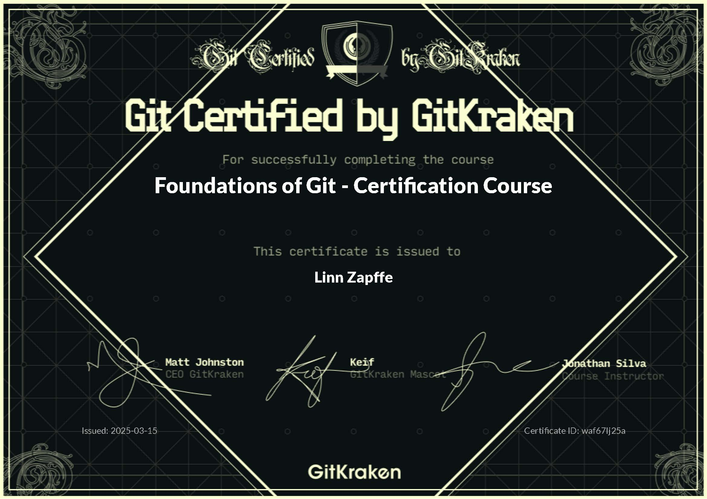

This project will look into GitKraken and more advanced workflows with Git/GitKraken. First, it will involve switching from using GitHub to GitKraken. Then, it will involve learning about more advanced workflows that might not be 100% necessary for projects that I am working on currently for this class, but which could involve a lot of fail-safes for when I potentially work with more advanced and comprehensive projects. It is better to learn how to do this now than later, when I really need it. I also realized that I could need a little more knowledge of Git after creating my repository for the portfolio, then trying to customize it, and then messing it up so much that I had to reset the repository, which also didn't work because of merge conflicts. I realized then that GitHub desktop is too simple and that I need to learn more about Git to be able to fix things when I mess up. This project ended up starting and ending in two very different places. However, here are the goal I had going into the project:

- To set up GitKraken successfully
- Learn basic usage of GitKraken, such as pulling, pushing, and connecting to local repositories
- Learn about more advanced workflows with Git, such as using forks, merges, and branches
- To become comfortable using GitKraken and more advanced workflows
- The final goal of this project will be to know enough about Git to create a pull request from a forked version of this class to update the contract template that was made in project 1, as well as change some other minor problems, such as broken or out-of-date links in the course

# GitKraken

## Setting up GitKraken

Got GitKraken downloaded and signed in. It is now also linked to Github (by following the prompting in the GitKraken tutorial) and I have opened the public repositories that I have stored locally on my computer. I can't open the private ones yet, since I don't have the student developer pack through GitHub.

After fighting with GitHub student developer pack for a while, I got it. They rejected me first, which I think is because my GitHub profile didn't have enough identifying information. So I added my name and address to the billing information, a profile picture, a bio about me being a Wake Forest student, my location, my full name displayed on the profile, and connected my OrcID account. I can always remove things later. I also got a enrollment verification that I tried submitting. They didn't want a pdf, so I converted it to a png. However, after having submitted it once and gotten rejected, I wasn't allowed to submit the same documentation again (even though the problems were more likely related to the GitHub profile information). I tried converting the pdf to png again, hoping the document would have some different metadata and that GitHub would let me submit it again, but that didn't work. Eventually, I had to print out my enrollment verification and take a picture from my computer camera of the printed enrollment verification. That got me verified within a few days. So, long story short, sign up to GitHub with your student account to begin with. If you already have a GitHub account, change all your profile information to identify who you are and then hand in an application.

## Basic GUI of GitKraken

Most of the notes here are taken from the [GitKraken help sides](https://help.gitkraken.com/gitkraken-desktop/interface/#elementor-toc__heading-anchor-0)

# More Advanced Workflows

Most of this material comes from the workflow part of the [Foundations of Git Certification Course by GitKraken](https://learn.gitkraken.com/courses/git-foundations). The rest, such as trunk-based workflows and some further details come from various pages on Google.

## The Different Types of Workflows

There are many types of workflows and after having gone over several of them, I will highlight the characteristics of the main ones here and then evaluate what I think seems to be the most relevant to the type of work I do.

### GitHub flow

GitHub flow is often used in scenarios when you do not have to support multiple versions of a code. One maintains a main branch that is only for code that has been tested and which we know work. Then, one keep different feature branches, one branch per feature or bug fix, to develop new features. When the code for the features is done, one can create a pull request that someone else on the team can look over and then merge that branch with the main branch.

### Git flow

Git flow is a more elaborate strategy that involves many different types of branches. This flow is especially helpful if one has several versions of a product that has to be maintained at once.

The flow uses 5 different types of branches:

- main - Production-ready code that can be released
- develop - Pre-production code with newly developed features that are in the process of being tested
- feature - Working on a new feature. This branch will typically be merged with the develop branch as code is finished.
- release - Finishing touches and minor bugs for preparing new production releases
- hotfix - Quickly address necessary changes in your main branch. You typically branch this from your main branch and merge it with both the main and develop branch afterward.

### Trunk-based flow

The trunk-based flow involves a different view on branches, as having many branches at once, especially those that last for a while, can quickly lead to a lot of merge conflicts (the same code has been changed by different people in different versions of the file, without updating the file in-between). Therefore, this workflow uses minimal with feature branches, only if necessary, for example if testing out a highly experimental feature. If one uses a feature branch, this should pull and push to the main branch as often as possible and should be merged back into main as soon as possible too. The changes being made to the main branch while checking out (working in) the main branch should also often pull and push their changes as often as possible. This way, everyone are working on updated versions of code and there will be minimal with merge conflicts.

## Reflections on Git Workflows

I don't typically create code that needs to be in different versions, so I think something like Git flow that has 5 different types of branches might be a little more complicated than what I need. However, I find the idea of using GitHub flow, with only feature and main branches, intriguing. I get the benefit of using a trunk-based method, so that one doesn't have to deal with merge conflicts all the time. However, even though it requires a little more work in terms of keeping an overview to make sure features aren't overlapping, it seems like the workflow could be better organized with a flow like GitHub. For example, if working on some data wrangling, I could have one branch for main, one for running some more advanced models, one for data wrangling, and one for drawing inferences from some statistical tests. This would separate the different actions more and also give a much better overview (at least in GitKraken) of the different mini-projects I am working on. I therefore want to try out using GitHub with GitKraken and see how much of a problem merge conflicts might become. If it gets too complicated, a trunk-based method might be better. However, I do want to at least try to GitHub flow method first.

## Mid-project Reflection

I have been working through the tutorial/help pages on GitKraken's webpage. It was kind of intimidating to get started with GitKraken because there is so much going on. However, what I realized after working past the initial set-up and customization pages is that I don't know enough about Git to learn how to use GitKraken. I therefore started a side-track of learning Git with the Git [foundations tutorial](https://learn.gitkraken.com/courses/take/git-foundations/lessons/38787021-welcome-to-the-foundations-of-git) by GitKraken. This course was very helpful to learn about Git and since it was hosted by GitKraken, it also showed how to do everything in GitKraken, as well as in the terminal. I therefore ended up doing more of a theoretical deep-dive than the more practical I initially envisioned. However, you will see some of the more practical aspects being employed in the later projects, projects 7-10, where I have used GitKraken and Git extensively. I also ended the project by taking the Git foundations certification and passing it.

I will post the git certificate at the end and the rest of the project will consist of notes from going over that course. I took most of them on paper, since there was a lot of back-and-forth, so these notes will likely not reflect everything I learned, but instead show a little bit of it. I aspire to one day integrate all of the notes and structure them so that others can learn to use Git and GitKraken from the notes. However, in the meantime, I will use it mostly for my own reference when I get stuck in GitKraken.

# Part 2 - Learning about Git and GitKraken

The Git course was hosted by GitKraken, so the Git basics information will be integrated with GitKraken specific information throughout this section.

## Basics in GitKraken

- GitKraken lets you have several profiles, so you can have a work and personal profile. The avatars can be different, you have different integrations, you will have a different commit signature, and the customizations you make are specific to your profile. You can therefore for example have a black background for one profile and a green one for another, to easily differentiate which profile you are working with.
  - You can also customize the theme of a profile further than the option provided in Git by importing themes from internet and dropping them in the themes folder in your computer under GitKraken (see file path under "UI cutomization"). There you will also find templates made by GitKraken that allows you to play around with option to make your own theme
- You can switch to showing initials instead of your profile picture in commits in preferences
- You can type any command or thing you are wondering about in the command palette. It is the symbol that looks like a sparkly magic wand to the top right in GitKraken. Search for anything you can find there. You can also open it with Ctrl + p.
  - This command palette can also interact with external programs, for example open a repository in an external editor, such as Rstudio
- There are many shortcuts you can use in GitKraken:
  - Ctrl + l -> Fetch all
  - s -> Stage current file
  - Ctrl + shift + s -> Stage all files
  - Ctrl + enter -> Commit current files with current message
  - Ctrl + shift + enter -> Stage all files and commit with current message
  - Ctrl + shift + m -> Places your cursor in the commit message box so that you can write the message directly
  - Ctrl + f -> Search in commits
  - Ctrl + / -> Opens an overview of keyboard shortcuts
  
  
### GUI

There are 4 main areas in the GUI when in a repository in GitKraken:
- The commit graph is in the middle of the screen, with a graph with the commit history and the commit message
  - This graph gives you a quick overview of changes, who made them, and any branching or merging that may have occurred
    - You can resize this graph to decide how many paths of branching you want to show by dragging the arrow that pops up when your cursor is in-between the branches and commit messages in the graph
- The commit panel is the right-side panel with the unstaged and staged files and the box where you can add commit messages. You can click on individual files to see the diff view of that file.
  - When making a commit, you can also click on the arrow saying "commit options" right above the stage changes to commit button and check the box stating that you will automatically make a commit and push the changes to your remote, instead of having to manually commit the changes and then push them to the remote
- The left panel has an overview of all the local and remote repositories associated with the current repository and the branches associated with these. It also shows you pull requests, issues, and team work.
- The tool bar is the top bar with quick access to some common functions, such as:
  - Undo - Undo whatever change you just made. However, this only works if you did the change locally, not remotely
  - Redo - Redo whatever undo you just made. Note that this only works for local and not remote actions
  - Pull - This is to pull any changes. It will do a few different things based on what you have set as your default. To see what you default it (and change it) click on the little arrow and select another option. "Fetch" will only get the change, but not merge it, while the other options will do different levels of merging
  - Push - Pushes your changes remotely
  - Branch - Creates a new branch for whatever branch you are currently selected (see the colored branches/bars on the timeline window for the repository)
  - Stash - Stash your changes
  - Pop - Pop your stash to your WIP
  - Terminal - Opens the terminal to Git. Has autocomplete to guide you through using the terminal
  
When you click on a staged or unstaged file in GitKraken, you can see the diff view of that file, which is the difference between the committed file and the file you currently have in your WIP (Work in progress). The green lines are lines that have been added or the new changes to the file in the WIP compared to the committed file and the red are the ones that are removed or the lines as they are in the commit (as opposed to the WIP). When you are in the diff view you can click on the plus sign when the cursor is hovering over a line to stage individual lines of the file instead of the entire file. There are three different views of the diff view: hunk view, inline view, and split view, try the three different views by clicking on any of the three boxes to the top right in the diff view window.
  - If you want to delete your WIP, you can right-click on it (it will be at the top of your commit graph) and choose "discard changes" or click the trash icon in the commit panel when the WIP is selected.

You can also edit files themselves in GitKraken, if you for example just need to add or remove a quick line before making a commit. You can also create new files within GitKraken. The easiest way to create a new files seems to be with the command palette. That is the go-to anytime you don't know where something is or are wondering whether something is possible in GitKraken.

When performing Git actions, you can often do these actions by grabbing a branch in the work tree and dropping it onto another branch. This can for example be done to merge, rebase, or add a pull request for a branch. If you want to make customizations to these quick actions, like add comments or assign people to a pull request, you can do that by clicking on the pull request after doing the action (e.g. in the left panel)

The changes you have made to your local repository that is not yet committed, will be in your WIP (work in progress). You can double-click on your WIP (it is at the top of your work tree) to open the commit panel. If you hover over a file in the commit panel, it will show a button that will let you stage that file. You can also double-click on the file to get the diff view, where you can examine the differences between your committed changes and WIP, as well as stage individual lines in a file.

You can create workspaces where you group together several repositories that are related in some way. This allows you to clone, pull, and push several repositories at once. You can also click on focus view for a workspace and see all updates for all of the repositories that have been grouped together, such as commits, issues, and pull requests.

Using interactive rebase in GitKraken

Using submodules

Using Git worktree to check out and work in multiple branches at once

## Basics of Git

### Git Concepts

There are two types of repositories: remote and local ones. The remote repositories are hosted on internet while the local repositories are the ones you have saved on your computer

A commit is a snapshot of your files at a specific moment. The workflow in Git is that you are making changes to files in your current repository. This gets saved in your project directory (where you have the files for your repository) on your computer. When you want to make these changes more permanent, you stage them to indicate that you want to move these changes from your WIP to the repository. This saves these files from your WIP into a folder in the .git folder, called /index. When you actually decide that you are happy with the files you have staged and want to make all of these changes a part of your history (take a snapshot), you commit them, which saves the changes to the /objects folder, also in your .git folder. This way, you have created history that is saved in the .git folder, in addition to the changes you had from the beginning in your files when working on your WIP.

You can work with several branches in a repository. However, you can only work in one branch at a time. When you are working in a branch, you have it "checked out", which means that any changes you are doing and everything you see is from that branch.

### Commands

- Git init -> The commands that create the .git folder. This is where all the history and changes that allow you to go back in time gets saved. If you delete this folder, you will delete all the history and what we consider a repository and instead just be left with the files as they currently are in your local repository
- Git clone -> Creates an exact copy of all files and changes to a repository at the time of cloning it
- Git revert -> A new commit that works like an inverse commit. You will still have your history with all your previous commits, but the code will look like it was earlier, since the new (revert) commit reverted the code to an earlier point.
  - You can do this in GitKraken by right-clicking the commit you want to revert the repository to and chose "Revert commit". It will ask whether you want to make the changes immediately (which will stage and make the commit with a default message) or not (which will stage the files, but not make the commit).
  - Note that git revert only reverts the repository by making the inverse of the selected commit, not all the changes that may have occured in between the current and selected commit. Therefore, you have to do this multiple times if you want to rever the repository back several commits. It is possible to do this faster in the terminal
- Git checkout
- Git merge
- Git rebase
- Git pull
- Git request-pull (pull request)
- Git stash
- Git cherry-pick
- Git squash
- Git tag
- Git reset
  - Soft
  - Mixed
  - Hard
- Git 

  
- Forking a repository
- Creating hooks
- Using patches

### Div other things Git

There are a lot of god practices regarding commit messages. Some of these practices will be specific to the culture with the other people you collaborate with. However, here are some general good practices that many people use when making commits:

- Only make a commit for one topic or change at at time
  - If you have multiple changes at a time, divide them up into multiple commits by staging only the relevant files per commit
    - This will help if you need to revert a commit for something, as you could revert a commit with only the relevant changes, instead of reverting a commit and having to tease out the changes you wanted and didn't want.
- Don't use punctuation
- Use the imperative verb form
  - E.g. Add a new file, modify the Readme file
- Start the message with either of these categories:
  - Feat -> Feature added
  - Fix -> Bug fix
  - Docs -> Changed documentation
  - Style -> Style or formatting changes
  - Perf -> Performance improvement
  - Test -> Tested a new feature
  - E.g. "Feat: Add search feature to commits"
  - Using these categories will make it a lot easier to search for specific commits later
- Add * to the end of the commit message if you also added a description
  
- Git LFS (Large file storage)
  
### Using the terminal

I like using the GUI and not the terminal for Git, as it is easier to keep track of everything. However, it didn't seem too complicated to use the terminal. Here are some basics of how to use it and you can then google the specific commands if you need it for anything.

- You can open the terminal in GitKraken by clicking on the Terminal button in the tool bar
  - The GitKraken terminal has autocomplete that will help you write the appropriate commands.
- Use git log to see previous commit hashes and messages
- When acting on a commit, you have to refer to at least the first 6 characters of the hash for that commit
- :qa will exit the current section or window if the terminal asks you to do something you don't want to do, like edit a commit message
- Example commands
  - git revert [hash] reverts the repository to a commit

## Git Foundations Certificate

## Final reflections and the Path Forward

Switching from GitHub Desktop to GitKraken and learning more about Git has opened my eyes to all the benefits of Git and how it can greatly improve my workflow on bigger projects, especially when collaborating with others. I have gotten much more comfortable using Git and I notice that I can use the terms and concepts a lot more freely, instead of having everything be this big mystery. I have adapted a lot of the things mentioned here, but there are still some that I could probably benefit from working on. For example, I tend to make big commits with a lot of changes, that works as a back-up if I would have to change anything, but it would be a lot more complicated than if I were to make a commit for each change or topic. I think I have adopted a lot of the other features though, and my commit messages are a lot better now. As you will see moving forward, I am using GitKraken and Git for all of the applied projects coming after this, which includes projects 7-10. This project has therefore allowed me to improve my workflow, get more into the lingo of Git, and learned to take part of the community that uses Git, such as sending pull requests for changes to the course pages for this course.

Although I have learned a lot from this project, there are always things that can be improved and expanded on. Therefore, here is a list of possible next steps that I aspire to take one day:

- Rewrite and clean up in these notes so that they could be used as a guide for beginners to Git and GitKraken
  - Add pictures to explain everything and show what I am talking about instead of just using text
- Get more comfortable using GitHub online, as that also offers a lot of the features GitKraken does
- Work through some of the more specific tutorials on GitKraken to learn some of the things I haven't gotten to yet