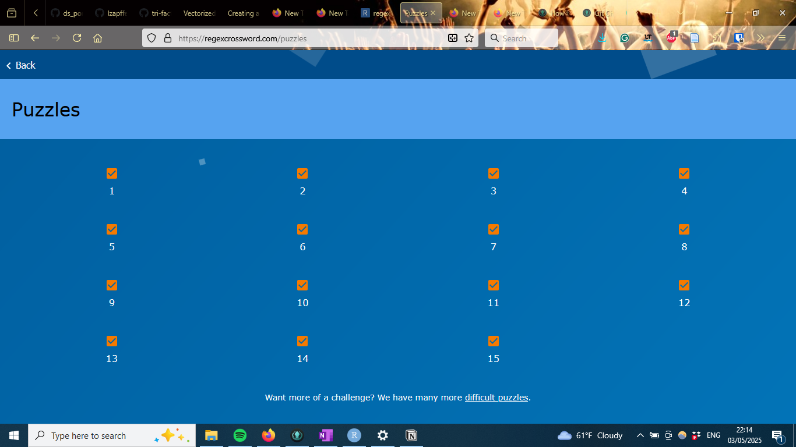

I have used several resources for my deep-dive into regex. These include:

- [Regex intro YouTube video](https://www.youtube.com/watch?v=NvHjYOilOf8)
- [Regex Tutorial by DataCamp](https://www.datacamp.com/tutorial/regex-r-regular-expressions-guide)
- [Regex Cheatsheet](https://hypebright.nl/en/r-en/ultimate-cheatsheet-for-regex-in-r-2/)
- [Regex functions in base R](https://bookdown.org/rdpeng/rprogdatascience/regular-expressions.html)
- [Regex functions in Tidyverse](https://r4ds.hadley.nz/regexps)
- [RexEgg Tutorials](https://www.rexegg.com/)
  - This is where most of the regex knowledge comes from and where I have spent the most time. I ended up working through all of the black belt portions, the main tutorial, and regex style guide 

Goals of the current portfolio project:

- Understand the overall logic of regex
- Learning some basic regex expressions
- Getting confident enough with regex that I can decode and make regex expressions, even if it requires some Googling to look up symbols
- Demystifying regex

Similar to with the last project, this project started with the quest to demystifying regex, as I have seen a lot of Stack overflow posts with solutions that look Greek. I wanted to be able to understand what people were suggesting and also learning it since it seemed useful. I learned regex and ended up finding some really good uses of it. You can even see that I have used in in project 7: Data wrangling quite a lot of efficiently find columns, rename them, and pivot the data set. I actually got more into it than I thought I would and therefore started on the Black Belt pages with Rexegg. This project therefore ended up being very much a deep-dive into the topic (more than I thought I would). I have notes from everything I learned, written as of when I learned them, so the organization of it could probably be updated, but that is a project for later.

Disclaimer: Rmarkdown (and html) interprets a lot of the special characters used in regex as a function. Therefore, creating a knitted html page that displays the syntax and not the action of the special characters has required playing around with escape characters in the Rmarkdown file. That means that the syntax for any regex is as displayed in the knitted file and not the Rmarkdown file. Therefore, always refer to the output file when looking up anything. I have gone over the document to look for places where the displayed syntax is off, but it is very possible that I could have missed some.

 

## Basics of Regex

Regex expressions consists of literals and metacharacers, which is like the actual words and grammar of a language.

The simplest regex expression is to just have one literal and no metacharacters. For example, you can have the expression "golf" which gives you all the lines that contains the string "golf".

Some of the metacharacters:

- "^" means start of the line
  - E.g. ^I think, will find all lines that start with "I think"
- "\$" means end of the line
  - E.g. morning$ finds all lines that end with "morning"
- "[]" allows for several characters that would be accepted
  - E.g. "[Bb] [Uu] [Ss] [Hh]" find all lines that have the word "bush" written, no matter whether the characters are all small letters, capital letters, or a mix between them. For example, "bush", "Bush", and "BUSH" would all be matched with this expression
  - You can also include ranges of letters or numbers within the square brackets
    - E.g. [a-z],[0-9], or [a-zA-Z]
- "[^]" means do not match
  - E.g. [^?.]$ would be all lines that do not end with ? or .
  - You can use this to stop a full match if you have a greedy quantifier and know a character that should not be matched
- "." means any character
  - E.g. 9.11 could match with "9-11", "9/11", and "9211"
  - The period can also match nothing, like "911"
- "|" means or
  - E.g. flood|fire would match any line that contains flood or fire
- "()" indicates that whatever is before it goes for everything inside of the parenthesis
  - E.g. ^([Gg]ood|[Bb]ad) means that the line has to start with either "Good", "good", "Bad", or "bad". While \^[Gg]ood|[Bb]ad would mean that it has to start with "Good" or "good", or contain "Bad" or "bad"
- "?" means that the part is optional, but if you have, it can only happen once. It either has the character before it or nothing, but it can't have anything else, and it can't have anything else following it
  - [Gg]eorge( [Ww]\.)? [Bb]ush would accept "George W. Bush", but also just "George Bush"
- "\\" means you escape the regex meaning of that character
  - [Gg]eorge( [Ww]\.)? [Bb]ush would mean you are looking for e.g. "George W. Bush" while just having [Gg]eorge( [Ww].)? [Bb]ush would mean there could be any character after the W, such as "George  WA Bush"
  - You can also do this by enclosing the character in square brackets, e.g. [.] would match a period only
- "*" means repeat any number of times, including 0
  - E.g. (.*) would match with lines containing (), either empty or with any string of any length
  - This metacharacter is greedy, meaning that it will match the longest possible match it can find
    - E.g. ^s(.*)s will match with the whole string in "sitting in starbucks" and not just the "sitting in s" part, since it wants as much as possible
    - You can turn off the greedy function with a "?", to make it lazy instead
      - ^s(.*?)s$
- "+" means repeated any number of times, but at least once
  In contrast to *, which is any number of times, including zero
  - E.g. (.+) would match () with any string of any length in it, but not empty
  - Works on the character immediately to the left of it, such as "s", "2" or "\\w". If you want more to be repeated together, you need to encompass it in parentheses
- "{}" are interval ranges of how many times something can be repeated
  - E.g. [Bb]ush( +[^ ]+ +){1,5} debate would match with any string that has "Bush" or "bush", then between one or five words, then the word "debate"
  - You do not have to specify a range, you can also put in only one number, meaning that it has to be repeated exactly that number of times, or a number with a comma, meaning it has to be repeated at least the specified number of times, but with no upper limit
    - E.g. {2} or {3,}
- "\1" or any other number means find the repeat of what was matched earlier in the parentheses. The number represents what group to find the same match as.
  - E.g. (\\d\\d)\\+(\\d\\d)=\2\+\1 could match 12+65=65+12 
  - +([a-zA-Z]+) +\1 + would match any lines that have two words that are repeated after each other, such as "one one" or "so so"
  - You can use this with str_replace to switch the order of characters in a string
  - If you need more than 9 back-references (in which you should probably name them instead), some languages interpret \\10 as a back-reference to 1 with a 0 afterward and other to the group 10. You can write it as \\g{10} to make sure it is interpreted as the category 10
  - The capture group 0 is usually the entire match of the expression
- You can name a capture group with (?<NAME>regex)
  - It is a little unclear how to get the backreference, it should be either \\k<NAME> or (?P=NAME). The code to capture the replacement string is also a little unclear, but could be ${NAME}, \\g<NAME>, $+{NAME}, or it is not possible and you have to use just \\1
- Capture groups are numbered from left to right, even if they do not capture anything. Likewise, if you run over a capture group several times, it will still just have that one number it got originally. If you capture several matches for one group, it will return the last match when called upon

 

## Regex functions in R

Here are some of the main R functions used with regex:

- grep() - Searches for matches with a regex and returns a vector with the indices for those matches
  - Setting the parameter value = TRUE will return a vector with the actual string matches instead
  - Only gives you the index of the whole relevant string, not where the match is on that string. regexpr() can give you the information of exactly where the match occur in the matched string
- grepl() - Searches for matches with a regex and returns a vector with TRUE and FALSE values
- regexpr() - Searches for matches with a regex and returns both the (first) start index of that match and the length of the string that matches
  - Only gives you the first match of the string. If you want all matches, you have to use gregexpr()
- gregexpr() - Searches for matches with a regex and returns both the start index of that match and the length of the string that matches. Returns all instances of the match, even if one the same string (i.e. item in the vector)
  - The g here stands for global
- sub() - Searches for matches with a regex and replaces that (first) match with what you specify
  - Will only replace the first match in a string, if you want to replace all matches in the string, use gsub()
- gsub() - Searches for matches with a regex and replaces that match with what you specify
- regexec() - Searches for matches with a regex, where part of the regex is in a parenthesis, and returns both the start character index of the match and the length of it, as well as the start character index of the match with the part that is in the parenthesis and the length of that part
  - E.g. regexec("\<dd>[F|f]ound on (.*?)\</dd>") would give both the start character index of the "<" that matches the rest of the expression and the length of the match, in addition to the first character index of the character starting after "on " and how long that is.
- regmatches() - Like regexec(), but returns the actual matches of the string, as well as the part specified in the parenthesis
- substr() - If you have the indeces of strings already, you can use substr() to extract the relevant string by index

 

### Tidyverse - Stringr

Tidyverse has the library stringr which has a maybe more intuitive function setup and names. For example, all the functions take the data as the first argument and the regex as the second argument.

- str_view() - shows you the string, where the match in your string is highlighed by being surrounded with <>
- str_subset() - like grep(value = TRUE) which return a character vector with the matches only
- str_which() - returns an integer vector giving the position of the strings that match
- str_detect() - like grepl() which returns a TRUE/FALSE vector for matches
  - You can combine filter and str_detect to filter by a regex
    - E.g. filter(str_detect(name, "x"))
  - You can also combine summarize or other stat functions with filter to calculate stats by the regex
    - E.g. mean(str_detect(name, "x")) will give proportions of names with an x in it per year
- str_extract() - like regexpr() and regmatches(), which extracts the string matches of the output
- str_match() - like regexec(), returning a matrix with the parenthesized sub-expressions
  - First column is first character of match and second is first character of match with the content in the parenthesis
- str_replace() - like sub(), replacing the first string
- str_replace_all() - like gsub, replacing all the strings
- str_locate() - like regexpr(), which returns the index of the first match and the length of the match, for the first match
- str_locate_all() - like gregexpr(), which returns the index of the first match and the length of the match, for all the matches
- str_count() - counts the number of matches in each string
  - You can combine this with mutate to e.g. make a new variable counting the number of vowels in a string
- separete_wider_regex() - take information from one column and separete it into several columns based on a regex
  - E.g. separate_wider_regex(str, patterns = c("<", name = "[A-Za-z]+", ">-", gender = ".", "_", age = "[0-9]+")) will get the information out of strings like "<Sheryl>-F_34"
  - If it fails, you can apparently use too_few = "debug", I don't know what it does, but it should be helpful

 

#### Optional parameters

- ignore_case = TRUE - the regex will ignore whether the characters are lower or upper case
- dotall = TRUE - lets a . match everything, including a new line?
- multiline = TRUE - matches the start or end of each line instead of just each string
  - Instead of being lazy based on string, it is lazy based on each new line
- comments = TRUE - ignores spaces, newlines, and # and everything following it in your expression. You can therefore add spaces and comments in the middle of your expresison (with line shifts) to make it more readable
  - If you then want to match a space, escape it with a backslash
  
 

## Special characters from literals

You can use a backslash to make normal literals a metacharacter

- \\w - any word character, including digit, letter, and underscore
- \\W - any non-word character
- \\d - any digit
- \\D - any non-digit
- \\s - any space character, including space, tab, and new line
- \\S - any non-space character
- \\b - a word boundary, such as a space or parenthesis before or after what is specified in the regex
  E.g. double backslash and bab matches "ab" in "abc", but not "bab", as that word doesn't start or end with "ab"
- \\B - a non-word boundary, such as another character after what is specified before this
  E.g. double backslash and Bab matches "ab" in "dabc", but not "abc", as that word starts start (or end) with "ab"
- \\n - a new line
- \\t - a tab
- \\v - a vertical tab
- \\< - beginning of a word
- \\> - end of a word
- \\A - beginning of a string
- \\z or \\Z - end of a string
  Depends on programming language
- \\G - beginning of string or end of previous match
  - E.g. if you want to only get the results from Jane on a score board, you can use the following regex (?:Jane|\\G) \\w+:(\\d+) to get the numbers from "Tarzan A:33 B:32 C:36 Jane A:35 B:33 C:31"
    - You could also do this will lookbehinds, but \\G is more economical

 
  
## Inline Modifiers

Modifiers change the mode of the following regex part. There is a way of changing the mode in a regex function, but using inline modifiers seem to be easeri. They will change the "mode" of the following regex, to match whatever the modifier is. This can save you from a lot of extra code, especially if you want e.g. all of your regex expression to be case insensitive.

- (?i) - case-insensitive mode
- (?s) - matches across lines
  - As if everything was on one line
- (?m) - multiline mode
  - Usually, anchors like ^ or $ only match the beginning or end of a string. If you turn on multiline mode, it will match the end or beginning of each line instead
- (?x) - free-spacing mode
  - You can write your regex with whitespace and line breaks that are not interpreted as characters to be matched. This allows for spacing out the regex to be more readable
  - E.g. var wordWithDigitAndCapRegex = new Regex(
   
@"(?x)      # Free-spacing mode
 
 
  ^         # Assert that position = beginning of string
 
 
  #########   Lookahead   ##########
 
  (?=       # Start lookahead
 
     \\D*       # Match any non-digits
 
     \\d        # Match one digit
 
  )         # End lookahead
 
 
  ######## Matching Section ########
 
  \\w*       # Match any word chars
 
  [A-Z]     # Match one upper-case letter
 
  \\w*       # Match any word chars
 
 
  $         # Assert that position = end of string
 
");
  - Now, to match a space, use either [ ] or "\\ "
  - Also, make sure you turn on free-space mode before using a space or line break in your code
  - Lastly, be aware that whitespace still separates components in the code. For example, \\12 is different from \\1 2
- (?n) - turns all parentheses into non-capture mode

 

## Built-in classes

Some of the above can also be specified as built-in classes with the following formatting [[:class:]]. Most of these have alternatives above.

- [[:alpha:]] - any letter
- [[:lower:]] - any lowercase letter
- [[:upper:]] - any uppercase letter
- [[:digit:]] - any digit
- [[:alnum:]] - any letter or number
- [[:xdigit:]] - any hexadecimal digit
- [[:punct:]] - any punctuation character
- [[:graph:]] - any letter, number, or punctuation character
- [[:space:]] - e.g. a space, a tab, or a new line
- [[:blank:]] - blank characters, such as space and tab
- You can also make your own with ranges
  - E.g. [[:alpha:]] could also be [A-z] and [[:lower:]] could also be [a-z]
  - E.g. [ -~] is all printable characters in the ASCII table
  - E.g. [!-~] is all printable characters in the ASCII table, except for space
  - E.g. (?![a-zA-Z0-9])[!-~] is all special characters

 

## Lookarounds
Lookarounds will look for the match you specify, either before or after the match (based on your expression). It will only match if the lookaround condition is met, but it will not actually capture the part in the lookaround. Lookahead or lookbehind refers to which direction it is looking in. The reason it doesn't capture anything is that it is like it hasn't moved further in reading the string when reaching a lookaround, is stays stagnant, looks ahead or behind (without moving) and then it starts moving when it gets to the code past the lookaround 

- (?=) - Positive lookahead
  - E.g. if you have (?=\\d{10})\\d{5}, it is similar as saying, if there are 10 digits here, match the first 5 of them
- (?<=) - Positive lookbehind
  - E.g. 	if you have (?<=\\d)cat, it is simlar as saying if there is a number before "cat", match with "cat"
- (?!) - Negative lookahead
  - E.g. if you have (?!theatre)the\w+, it is simlar to saying if the word isn't preeceded by "theatre", match "the" and any letter after it
- (?<!) - Negative lookbehind
  - E.g. if you have \w{3}(?<!mon)ster, it is the same as saying if you have three letters, that are not "mon", and the "ster", match those three letters and "ster"
  
- If you test multiple conditions, you can usually use n-1 lookarounds, where n is the number of conditions you have. This is because you need to capture something too, so the last condition can be a capture group instead of a lookaround.
- Also be aware, if you test multiple conditions, that since the lookahead doesn't move, if you have two lookaheads, they will start from the same position, not subsequent positions.
- When you decide on whether you should use a lookahead or lookbehind, see what would require matching the fewest characters. There is usually one position that is more efficient than the other.
- You can nest lookarounds, for example this regex \\d+(?=\_(?!\_)) to find numbers that is followed by one, but not more than one underscore.
- It is often good practice to anchor lookarounds, as that makes them fail or succeed immediately, instead of running through the whole string, as long as that is not what we want to do

 

## Other more advanced stuff

- (?:) - a non-capture group, so that you do not capture what is inside of the group
  - It is good practice to always use a non-capture group if you need the parenthesis for the expression, but don't need to capture what is inside of it
- [[:<:]] - beginning of word boundary. Only match if at the beginning of a word. Nothing can come before it, the word starts with what has been provided
  - E.g. [[:<:]]cat matches cat and catfish, but not tomcat
  - Similar to \\b(?=\\w)?
- [[:>:]] - end of word boundary, nothing can come after it, the word stops there
  - E.g. cat[[:>:]] matches cat and tomcat, but not catfish
  - Similar to \\b(?<=\\w)?

There is a difference between delimiters and boundaries. Boundaries look at whether there is a difference between what comes before and after the relevant part. A lookaround will only look in one direction. You can however use both a lookahead and lookbehind to detect boundaries.

If you make a boundary yourself, you can define it and then later call it by that name. For example:
 
 
(?x)             # free-spacing mode
 
(?(DEFINE)       # Define some subroutines
 
   (?<A1>           # Define "A1" boundary
 
                    # This boundary matches when
 
                    # one side is a letter and
 
                    # the other is a number
 
   (?i)(?<=^|\\d)(?=[a-z])|(?<=[a-z])(?=$|\\d)
 
   )                # End A1 definition
 
)                # End DEFINE
 

The actual regex matching starts here
 
We can use our "A1" boundary wherever we like
 
(?&A1)cat(?&A1)

 

## Quantifiers

- For example +
- All quantifiers are by default greedy, meaning that they will match as much as possible
  - For example, using \d+ on 123 will match 123, not 1 or 12
  - The quantifier is also docile, meaning that it will give back parts if needed to match the rest of the string
  - For example, if you use A+. to match on AAA, the A+ will first match all of AAA, then the . will fail to match anything. Therefore, the A+ part gives up one A, so that it can match with . Ultimately, the A+ therefore matches AA and the . matches A
    - If you instead have A+.., the A+ will match the first A and each . will match each own A.
  - Similarly, if you have the regex .*apple and the string A tasty apple, the . will first match everything, then backtrack when apple isn't matched, until it can match it. The ultimate result will therefore be that the . takes "A tasty " and the apple part matches with "apple".
  - The fact that it is greedy does not mean that it matches the longest match whenever in the string, but that it matches as much as possible from the first possible match
    - E.g. if you have 12 9999 and use \d+ it will match 12 and not 9999, even though it is greedy
- You can add a ? to a quantifier to make it lazy, so it matches as few characters as possible for the match to occur
- The quantifier ? matches with none or one match
  - For example, the match \w*?E will match with 123E in the string 123EEE, not with all of it, because the \w? only need to match with 123 to get an E afterward, not all of 123EE
- Lazy quantifiers match with as little as possible
  - Most lazy quantifiers are also helpful, meaning that it originally starts the match with the smallest possible match, then expands until the whole string matches
    - E.g. in our \w??E example, it starts matching nothing, since ? can be nothing, but then fails to match the E. Therefore, it tries adding 1, but still fails. Only after adding 123 does it succeed with a whole match, as the next character is E. This is lazy, but helpful behavior
    - The lazy quantifier matches the smallest possible match from the starting point, not for the entire string
- You can make a quantifier possessive by adding a + to it. This negates the docile behavior for greedy quantifiers
  - E.g. A+. will match the string AAA, but A++. won't, as all A's are taken up with the "A++" part, so that there is nothing left for the .
  - Sometimes, you can make a quantifier possessive if you know that it won't matter, especially if your match might fail. This will speed up the code, since it doesn't have to constantly back-track
  - Some engines, like R, looks at the string before starting and automatically makes a regex part possessive if this doesn't affect the matching, to make the code faster.
    - This can be turned off with (*NO_AUTO_POSSESS)
- The process of the engine going back when a pattern fails to see whether making other choices (e.g. matching fewer characters with a +) would lead to a match is called backtracking
  - Can help you catch more matches, but can also lead to the code running for a long time as the engine keeps backtracking to try all variations of how the regex can be applied to a match to see whether any of them will lead to a match
- There are some quantifiers that can lead to a lot of backtracking, called explosive quantifiers
  - These includes *, +, {x, }, or a specified range with a high number, like 10 or more
  - This can especially happen if you have two quantifiers in different places that can lead to an exponential number of possible variations
    - E.g. (A+)*
  - Another way of looking at this is to use contrast in your regex patterns. If you have a lot of parts of the regex that can fit multiple parts of the string, there will be many variations, while if you have more specific expressions, there will be less backtracking since there are fewer variations
  - You can use atomic groups to counteract this
    - Put a regex expression inside of (?>) to make the group atomic
    - Then, after the engine runs through the group, it cannot backtrack to try other variations
    - Atomic groups with one character and a quantifier is often the same as a possessive quantifier
      - E.g. (?>A+) is equal to A++, (?>A\*) is equal to A*+, and (?>A?) is equivalent to A?+
  - Generally, be as specific and concise as you can in your patterns to decrease backtracking
    - E.g. not (A|AA)+, but A+
- +, ?, and * are all greedy, but docile, matching one or more, zero or one, and zero or more parts of a string
  - Add + do either of these to make it greedy and possessive, so that it won't backtrack to make the match work
  - Add ? to either of these to make them lazy, so that they match to as few matches as possible. All of these lazy matches are still helpful, so it will be lazy by default, but take more if needed

 

## Conditionals

- You can add conditionals with the following syntax: (?(A)X|Y)
  - This statement says that if A is TRUE, then you do X. If not, do Y
  - (?(A)X) means if A, do X
    - No else statement
  - (?(A)|X) means if not A, do X. If A, match empty string
- You can force a regex to fail if it has a specific condition
  - E.g. Lets say that you want to match two possible combinations of words. Consider an ID system where you have a lot of IDs, followed by a status of either pending or active. However, some of the IDs are temporary, designated with the IDs beginning with TMP. These temporary IDs can only be active, not pending. Therefore, we will make a regex that can capture all of the valid IDs, but ignore the unvalid cases (temporary IDs that are pending). The regex ^(TMP)?\d+_(?:active|pending(?(1)(?!)))$. This code will capture "TMP" as an optional capture group, then some numbers, an underscore, and either the status pending or active. If it catches active, everything is fine. However, if it captures pending, and the first capture group is matched (meaning the string starts with "TMP"), then the match will automatically fail because of the (?!)
    - This example was developed in co-junction with ChatGPT
  - You can also fail with an if-else-then statement
    - E.g. ^(TMP)?\d+_(?:active|pending(?(1)|(?!)))$. In this code, there is either an active status, or whether there is a pending status and a "TMP" start string (i.e. the capture group has been set). If this is not the case, then it fails.
      - This is an opposite condition for the TMP and pending scenario as with only the if-else statement
      
 

## Recursive regexs

- You can add (?R) to repeat a pattern a selected number of times, instead of writing it all out.
  - E.g. \w{3}\d{3}(?R)? to match "aaa111bbb222"
    - You could alternatively use the regex "(?:\w{3}\d{3})+"
- You can add a conditional to the expression
  - E.g. Match a repeat of the word until the end of the string with "abc(?:$|(?R))"
- You can use these recursive regex to match more complicated patterns, like palindromes
  - E.g. (\w)(?:(?R)|\w?)\1
    - I haven't fully parsed how this regex works, but it is something to look into for more complicated expressions
  
 
    
## Control Verbs

- You can use backtracking control verbs to change what the engine does during a backtrack
  - The verbs will therefore not have any effect on the code (i.e be skipped) when matching and only have an effect if the regex needs to backtrack the matching
- There are many control verbs:
  - (*THEN) - Used with a conditional expression. Stops the match and moves on to the next possible condition (other side of |)
    - E.g. "Comedian: (?:B\w+ (\*THEN)Murray|E\w+ (\*THEN)Murphy|P\w+ Sellers)" to match the name of a comedian in a string. The (*THEN) makes it so that the expression does not backtrack if the last name is not the right one, given the first letter of the first name
    - In most situations you wouldn't really need the (\*THEN), but if you were to have a very long string before the (*THEN) statement, it could speed up the expression by getting rid of the backtracking. In this scenario, you could write it as "Comedian: (?:B\w+ Murray|E\w+ Murphy|P\w+ Sellers)" since the string isn't that long anyway
  - (*PRUNE) - Stops the match if it tries to backtrack past the expression. Starts over again if there are more terms to the regex (e.g. a conditional)
    - E.g. "\w{2,4} (*PRUNE)Murray|Bill Burr|Peter Sellers" to match a comedian's name again. If you have the name Bill Burr, the code will match the first part looking for 2 to 4 letters. When the B in Burr does not match the M, the match does not backtrack to only fitt "Bil" from the previous word, but does instead move straight over to the second conditional term, looking for a match to "Bill Burr"
    - Useful to hinder excessive backtracking for long strings
  - (*SKIP) - Stops the match if it tried to backtrack past the expression. Starts the match again from the string position where it was after the Skip if there are more terms to the regex (e.g. a conditional)
  - (*COMMIT) - Stops the match no matter whether there are other options if it tries to backtrack past the verb. Either the current match works or the entire regex fails to match
 
 
- There are also some verbs that are not backtracking verbs
  - (*ACCEPT) - Accepts the match, no matter what comes next
    - E.g. "B(?:A|I|O(*ACCEPT))Z" to match BAZ, BIZ, and BO. You could have written BAZ|BIZ|BO, but if Z were to be some long and complicated subroutine, Accept will make the regex more readable
  - (*FAIL) - Fails the current token in the string
    - Will lead it to automatically start backtracking
    - Can also be written as (*F)
  - (*MARK) - Marks the position which can be accessed later at $REGMARK to see which path the code took
    - Can also use a short-hand like (*:some_tag), without the MARK part
 
 
- You can use a combination of SKIP and FAIL to define what you do not want
  - E.g. "{[^}]*}(*SKIP)(*FAIL)|\b\w+\b" will match all words except for those encolsed in curly-brackets. Here, if the word has curly-brackets it matches the whole word, when hits skip and fail. It fails, so it will try to backtrack, but the skip tells it to not go past the current match, which is all of the string. Therefore, leading to an automatic fail
    - This is an useful way to define things you do not want to match, without creating too complicated expressions

 

## Div other comments that didn't fit anywhere else

- Cool trick: To match an even number of characters, you can use "^(?:..)+$"
  - This will match two characters, then do that as many times as necessary with the +, and then end because of the $
  - You can similarly look at whether the number of strings is a multiple of n with "^(?:.{n})+$"
- General advise: Be as specific as you can when creating regex and add contrast whenever you can
  - E.g. "^\\D+\\d{3}\$" this regex will be more efficient than "^.+\\d{3}\$" for matching three letters and three digits
- Thing I didn't look into that closely: [PCRE callouts](https://www.rexegg.com/pcre-callouts.php)
  - The use of this wasn't that well-described on the page and I didn't see an immediate use for it, so I didn't put much more effort into learning to use it
- Fun fact I learned: You can actually use explosive quantifiers to ReDoS attack a webpage by giving a regex that will have it run a very large number of variation, to eventually slow down or shut down a webpage [see more at Wikipedia](https://en.wikipedia.org/wiki/ReDoS)
  - I had heard about ReDos attacks earlier, but I didn't know what it was, so learning that was interesting

 

## Practice

I started creating questions with ChatGPT like I did for project 2, but they seemed kind of random and didn't really reflect what I would use Regex for when applying it. Instead I came across these [Regex crosswords](https://regexcrossword.com/), which are still not very applied, but involved a lot less set up with string for every question like ChatGPT's questions did. So, I switched over to working on the crosswords to practice using, reading, and interpreting regex expressions and got farily good at it at the end. I worked through all of the 15 basic crosswords.

 

## Final Reflection

I learned a lot from working on this project and certainly feel like I have demystified regex. I used it a lot when working on some of the later projects, especially project 7: Data Wrangling and some of the things I did with the regex would have taken me forever to do manually since there were so many columns in the data set. I therefore see the use of learning regex and think it was totally worth the time to learn it. I am not so sure about some of the more black belt related concepts, but I figured that learning all of it would mean that I would be able to be as flexible as possible with regex should I need it in the future. There are still a few things I would like to do to further this project:

- Go over the text and create a more coherent section. Right now it is loosely ordered after when I learned it (with a little back and forth when writing).
- Add more examples to illustrate the difference for people that might not know regex already
- Explore tools that help you build and validate regex expressions. Now I just do this manually by creating strings and testing what happens with different variations, but it is easy to forget about some variations to test and then get weird results.
  - I tried using chatGPT a few times and it is really not good with regex. But I would like to look further into pages like [this build page](https://regex101.com/).